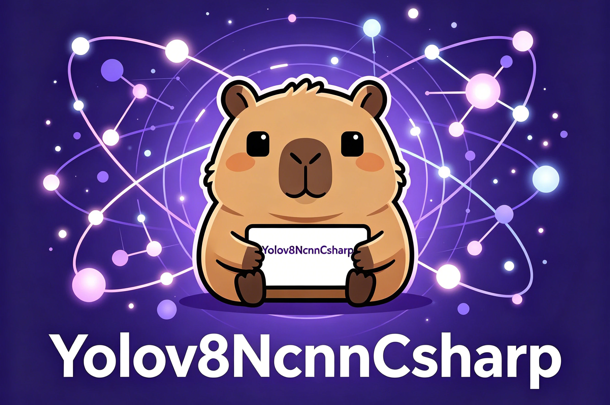
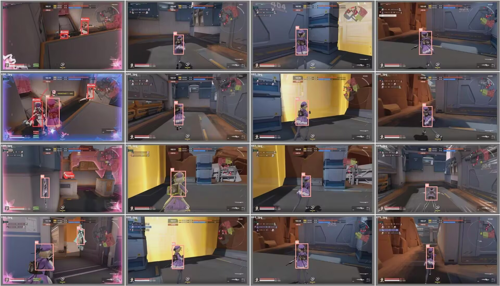
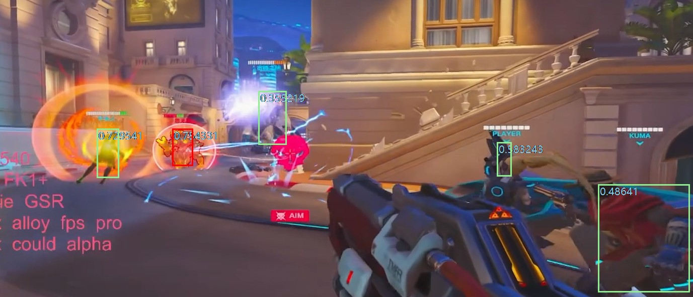
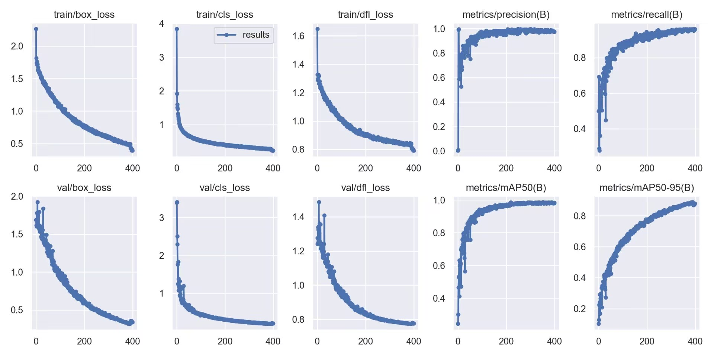

# [Yolov8AI视觉-极简调用](https://github.com/emokingbaby/Yolov8-NCNN-CSharp/tree/main)

基于腾讯**NCNN框架**的**YOLOv8 C#封装**，只需几行代码即可<ins>快速运行AI视觉模型</ins>。不需要你懂任何关于AI的算法知识!
>YOLOv8 C# library based on Tencent NCNN, easy to run AI vision models with just a few lines of code.You don't need to know anything about AI algorithms!

<p align="center">
  
</p>


# 环境搭建与使用 🌁

1. <mark>下载Dotnet SDK 10.0(推荐10.0)</mark>

    - 下载网址: https://dotnet.microsoft.com/zh-cn/

    >你可以下载<em>运行时</em>或<em>便携版</em>，随便你，最后只需要在<em>cmd窗口</em>输入:<strong>dotnet --version</strong>,如果显示<ins>10.0.203</ins>代表环境配置成功🌱。


1. 在任意目录下，创建你的第一个<strong>CSharp 控制台项目(dotnet new console)</strong>。别告诉我你不会创建，去学📗~
    >在目录中，应包含<ins>两个基础文件:<strong>Program.cs 和 project.csproj</strong></ins>
    >
    ><font color="red">注意:开源dll均为32位dll，你应该使用32位环境去编写代码。如果你的Csharp环境是64位，可以在打包的时候选择32位打包运行</font>


1. 将本次开源的<ins>两个dll文件</ins><strong>复制到项目根目录</strong>
    ><strong>Yolov8ChenZhe.dll</strong>和<strong>Yolov8Ncnn.dll</strong>

  
1. <strong>project.csproj 文件编写</strong>

    ```html
    <Project Sdk="Microsoft.NET.Sdk">
      <PropertyGroup>
        <OutputType>Exe</OutputType>
        <TargetFramework>net10.0</TargetFramework>
        <ImplicitUsings>enable</ImplicitUsings>
        <Nullable>enable</Nullable>
      </PropertyGroup>
      <ItemGroup>
        <Reference Include="Yolov8ChenZhe">
          <HintPath>Yolov8ChenZhe.dll</HintPath>
        </Reference>
      </ItemGroup>
      <ItemGroup>
        <Content Include="Yolov8Ncnn.dll">
          <CopyToOutputDirectory>PreserveNewest</CopyToOutputDirectory>
        </Content>
      </ItemGroup>
    </Project>
    ```

1. <mark>运行与打包</mark>
    ><strong>运行(SDK必须是32位):dotnet run</strong>
    >
    ><strong>打包:dotnet publish -c Release -r win-x86 --self-contained true -p:PublishSingleFile=true</strong>


<table align="center">
  <tr>
    <td align="center"></td>
    <td align="center"></td>
    <td align="center"></td>
  </tr>
</table>


# API介绍 📌
>具体详情请见开源文件:<font color="orange">Yolov8NcnnCSharp API快速介绍</font>

1. <mark>开始前的准备</mark>
    ```cs
    using Yolov8ChenZhe;//使用开源项目命名空间

    //实例化该命名空间中的 CZyolov8 对象
    public static CZyolov8 cZyolov8 = new CZyolov8();
    ```

1. <mark>加载模型 LoadModelFromFile</mark>
    ><font color="red">本开源项目不包含模型训练与导出</font>
    >NCNN框架的yolov8有<strong>2个模型文件</strong>和<strong>1个自定义文件</strong>
    >
    ><strong>param文件</strong>和<strong>bin文件</strong>是模型训练完后默认导出的官方文件
    >
    ><strong>names文件</strong>:将识别id绑定一个名称。names文件必须要有而且不能为空(可以自己创建一个，里面随便写点东西)，可以参考开源项目<ins>mod文件夹中守望先锋的names模型</ins>
      - **.names**
        >当ai识别一个物体id = 0时，则返回apple
        >当ai识别一个物体id = 1时，则返回banana
        ```txt
        apple
        banana
        ```
      
      - **Program.cs**
        ```cs
        //加载模型(成功返回true，失败返回false)。该函数为单线程（不推荐多线程加载，可能会崩）
        bool IsLoadSuccess = cZyolov8.LoadModelFromFile(
            // Path.Combine(AppDomain.CurrentDomain.BaseDirectory, "") : 获取exe文件所在目录
            paramFile: Path.GetFullPath(Path.Combine(AppDomain.CurrentDomain.BaseDirectory, "./aaa.param")),//.param文件路径(腾讯Yolov NCNN框架模型标准文件。可以使用ONNX文件转换)
            binFile: Path.GetFullPath(Path.Combine(AppDomain.CurrentDomain.BaseDirectory, "./aaa.bin")),//.bin文件路径(腾讯Yolov NCNN框架模型标准文件。可以使用ONNX文件转换)
                                                                                                              //.names文件路径(非标准文件，但是必须要有)
                                                                                                              //如果没有该文件可自己创建一个，参考Yolov8NcnnCsharp模型示例框架中mod文件夹中names文件写法
                                                                                                              //names文件作用:将ai识别id对应到字符串上。id = 0的识别结果对应names文件第一行的字符串
            namesFile: Path.GetFullPath(Path.Combine(AppDomain.CurrentDomain.BaseDirectory, "./aaa.names")),
            cpuThreads: 1,//Cpu线程推理。在任务资源管理器->性能->CPU->逻辑处理器数量。通常一台家用电脑都是8~12线程。
                          //这里通常写1就行。如果输入线程超过电脑最大线程，会自动设置为1
                          //如果开启显卡推理，这里写不写无所谓
            useGpu: true,//开启显卡推理。显卡推荐英伟达，核显也可以，需要显卡驱动。如果电脑显卡实在带不动，就选择false。
            deviceId: 0,//显卡设备id选择第一张显卡。显卡设备id也可在任务资源管理器中查看。通常第一张卡是intel的核显。如果你有外部显卡是最好
            password: ""//模型密码。因版权问题有些模型是加密的需要密码。如果没有则填空。
        );
        ```

1. <mark>卸载模型 UnloadModel</mark>
    ```cs
    //卸载模型(单线程,不推荐多线程卸载，可能会崩)
    //模型卸载成功返回true，失败返回false
    bool IsUninstallModelSuccess = cZyolov8.UnloadModel();
    ```

1. <mark>识别屏幕 DetectScreenArea</mark>
    ```cs
    // 以对象方式返回所有识别结果存入当前容器。识别结果会自动清空与填充
    //targets[i].ObjId : 识别对象id
    //targets[i].X :  识别对象在屏幕中的x坐标
    //targets[i].Y :  识别对象在屏幕中的Y坐标
    //targets[i].W :  识别对象的宽度
    //targets[i].H :  识别对象的高度
    //targets[i].Prob :  识别对象的可信度
    //targets[i].Name :  识别对象的名称
    public static List<YoloTarget> targets = new List<YoloTarget>();
    public static string resultText = "";//返回识别结果的字符串文本(识别物体名称,对象屏幕坐标...全部写进一个字符串，以|分隔)
    public static int useTime = 0;//识别耗时（通常在8ms ~ 14ms）

  

    //开启屏幕识别,识别到内容则返回true，否则返回false(单线程函数，大家需要配合后台线程与循环去执行)
    Task.Run(() =>
    {
        while (true)
        {
            //每调用1次就识别1次。后续使用需要在循环中执行。
            bool IsDetectSuccess = cZyolov8.DetectScreenArea(
                left: 0,//识别区域左上角在屏幕的X坐标
                top: 0,//识别区域左上角在屏幕的Y坐标
                width: 1920,//识别框宽度(单位像素)
                height: 1080,//识别框高度(单位像素)
                targets: out Program.targets,//识别结果存入容器
                resultText: out Program.resultText, //识别结果字符串存入字符串
                useTime: out Program.useTime,//识别结果耗时存入
                confidence: 0.4d,//置信度阈值。低于阈值的不会被识别。阈值范围0~1。类型：双精度
                targetSize: 640 // 模型输入尺寸 (Input Size),根据训练导出的数据集来定。通常是640
            );

            if (IsDetectSuccess)
            {
                foreach (YoloTarget i in Program.targets)
                {
                    Console.WriteLine($"对象ID:{i.ObjId}--X坐标:{i.X}--Y坐标:{i.Y}--宽度:{i.W}--高度:{i.H}--可信度:{i.Prob}--名称:{i.Name}");
                }
            }
        }

    });
    ```

1. <mark>快速识别屏幕 DetectScreenAreaFast</mark>
    ```cs
    Task.Run(() =>
    {
        while (true)
        {
            //快速识别(只返回bool值。识别到返回true，否则返回false)
            bool IsDetectSuccess = cZyolov8.DetectScreenAreaFast(
                left: 0,//识别区域左上角在屏幕的X坐标
                top: 0,//识别区域左上角在屏幕的Y坐标
                width: 1920,//识别框宽度(单位像素)
                height: 1080,//识别框高度(单位像素)
                confidence: 0.4d,//置信度阈值。低于阈值的不会被识别。阈值范围0~1。类型：双精度
                targetSize: 640// 模型输入尺寸 (Input Size),根据训练导出的数据集来定。通常是640
            );
        }
    });
    ```

1. <mark>传入图片信息识别图片 DetectImage</mark>

    ```cs
    //exe所在目录放一张图片进行识别
    byte[] imageBytes = File.ReadAllBytes(Path.Combine(AppDomain.CurrentDomain.BaseDirectory, "./1.jpg"));

    //传入二进制图片信息，识别成功返回true，否则返回false。并返回识别结果
    bool IsDetectImageSuccess = cZyolov8.DetectImage(
        imageBytes: imageBytes,
        targets: out Program.targets,//识别结果存入容器
        resultText: out Program.resultText, //识别结果字符串存入字符串
        useTime: out Program.useTime,//识别结果耗时存入
        confidence: 0.4d,//置信度阈值。低于阈值的不会被识别。阈值范围0~1。类型：双精度
        targetSize: 640 // 模型输入尺寸 (Input Size),根据训练导出的数据集来定。通常是640
    );

    if (IsDetectImageSuccess == true)
    {
        foreach (YoloTarget i in Program.targets)
        {
            Console.WriteLine($"对象ID:{i.ObjId}--X坐标:{i.X}--Y坐标:{i.Y}--宽度:{i.W}--高度:{i.H}--可信度:{i.Prob}--名称:{i.Name}");
        }
    }
    ```

1. <mark>传入图片路径识别图片 DetectFile</mark>

    ```cs
    //exe所在目录放一张图片进行识别
    string imagePath = Path.Combine(AppDomain.CurrentDomain.BaseDirectory, "./1.jpg");

    //功能5：传入图片路径，识别成功返回true，否则返回false。并返回识别结果
    bool IsDetectImageSuccess = cZyolov8.DetectFile(
        imageFile: imagePath,//图片路径
        targets: out Program.targets,//识别结果存入容器
        resultText: out Program.resultText, //识别结果字符串存入字符串
        useTime: out Program.useTime,//识别结果耗时存入
        confidence: 0.4d,//置信度阈值。低于阈值的不会被识别。阈值范围0~1。类型：双精度
        targetSize: 640 // 模型输入尺寸 (Input Size),根据训练导出的数据集来定。通常是640
    );

    if (IsDetectImageSuccess == true)
    {
        foreach (YoloTarget i in Program.targets)
        {
            Console.WriteLine($"对象ID:{i.ObjId}--X坐标:{i.X}--Y坐标:{i.Y}--宽度:{i.W}--高度:{i.H}--可信度:{i.Prob}--名称:{i.Name}");
        }
    }
    ```
